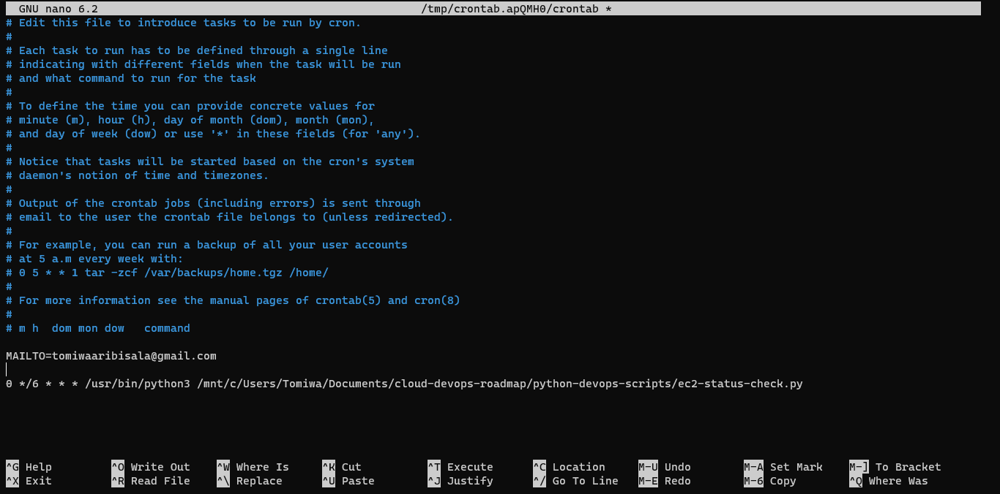

## Python DevOps Automation Scripts

### Prerequisites

- Install AWS CLI and set AWS credentials---AWS_ACCESS_KEY_ID, AWS_SECRET_ACCESS_KEY, and AWS_REGION

- Install Python 
```
sudo apt install python3
```

- Install AWS Python SDK package
```
pip install boto3
```
Boto3 connects automatically with AWS credentials to make API calls to your AWS account. 

### Running Automated Scripts as Cron Jobs 

- Ensure your python file is executable 
```
chmod +x ec2-status-check.py
```

- Ensure CRON is running
```
service cron start
```
```
service cron enable
```
```
service cron status
```

- List Cron Jobs for the current user 
```
crontab -l
```

- Create a Cron Job for the python file using the command:`crontab -e`, the command launches an the crontab file in edit mode, press `i` to edit the file

- Add the command to execute the python file every six hours:
`0 */6 * * * /usr/bin/python3 /mnt/c/Users/Tomiwa/Documents/cloud-devops-roadmap/python-devops-scripts/ec2-status-check.py`

- By default the output of the crontab jobs (including errors) is sent through the email of the user which the crontab file belongs to, however, you can specify an external email address that cron sends to with the `$MAILTO` variable. 


- Press `esc` to exit the editing mode

- Type `:wq` to save and quit the file; w means to write and q means quit.

- To delete a single cron job: Use the command:`crontab -e`, press `i`, press `dd` to delete the cron job line and press `:wq` to write and quit the file